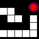

# SNAKE GAME 🐍



## DISCLAIMER

**IMPORTANT**: This game has been tested and confirmed to work on a system running Windows 11. While efforts have been made to ensure compatibility, there may be variations in performance or functionality on different systems or operating systems.

If you encounter any problems, bugs, errors, or have suggestions to improve the game, I encourage you to reach out and provide feedback. Your input is valuable in enhancing the gaming experience for all players.

## CONTACT INFORMATION

Feel free to contact me with your feedback, questions, or suggestions. We're here to help and appreciate your input!

- **DISCORD**: `xmatak`
- **EMAIL**: [exmatak@gmail.com](mailto:exmatak@gmail.com)

Your feedback is essential in making this game even better. Thank you for playing!


## DESCRIPTION

The Snake Game is a classic arcade game where you control a snake that moves around the screen and tries to eat food. The snake grows longer each time it eats the food, and the objective is to get as long as possible while avoiding collisions with the game boundaries and yourself.

## FEATURES

- Control the snake's direction using arrow keys (up, down, left, right).
- Eat the red food to grow the snake and earn points.
- The game keeps track of your score.
- The snake changes color after eating each piece of food.
- The game is displayed on a 600x600 grid.

## HOW TO PLAY

1. **INSTALLATION:** Ensure you have Python 3.x installed on your system.

2. **RUNNING THE GAME:** 
   - Open your command prompt (cmd).
   - Navigate to the directory where you downloaded the game using the 'cd' command:
     ```
     cd C:\yourPath
     ```
     For example:
     ```
     cd C:\Users\mgros\povinneProgramko
     ```
   - Run the Python file to start the game:
     ```
     python snakeGameMG.py
     ```

3. **GAME CONTROLS:**
   - Use the arrow keys to control the snake's direction.
   - Your goal is to eat the red food to grow and earn points.
   - Be careful not to touch the game boundaries or collide with the snake's own body, as it will result in game over.

4. **SCORING:** The game keeps track of your score. Try to achieve the highest score possible.

## REQUIREMENTS

- Python 3.x installed on your system.
- Turtle graphics library, which is included in Python's standard library.

## ACKNOWLEDGEMENTS

This game is a simple implementation of the classic Snake Game and serves as a fun and educational project.

## WORK IN PROGRESS (WIPs)

- More optimized implementation: The current code renders the snake's tail many times, which can lead to performance issues at higher scores. A patch to optimize this behavior is in progress.
- You might experience flickering of squares for a few moments while collecting your first few apples. At this moment I have no idea what causes it and how to fix it. I am offering a hotdog from the buffet as a bug bounty.

Enjoy playing the Snake Game! If you have any questions or suggestions, feel free to reach out.


Created by XMatak, -Mia G.